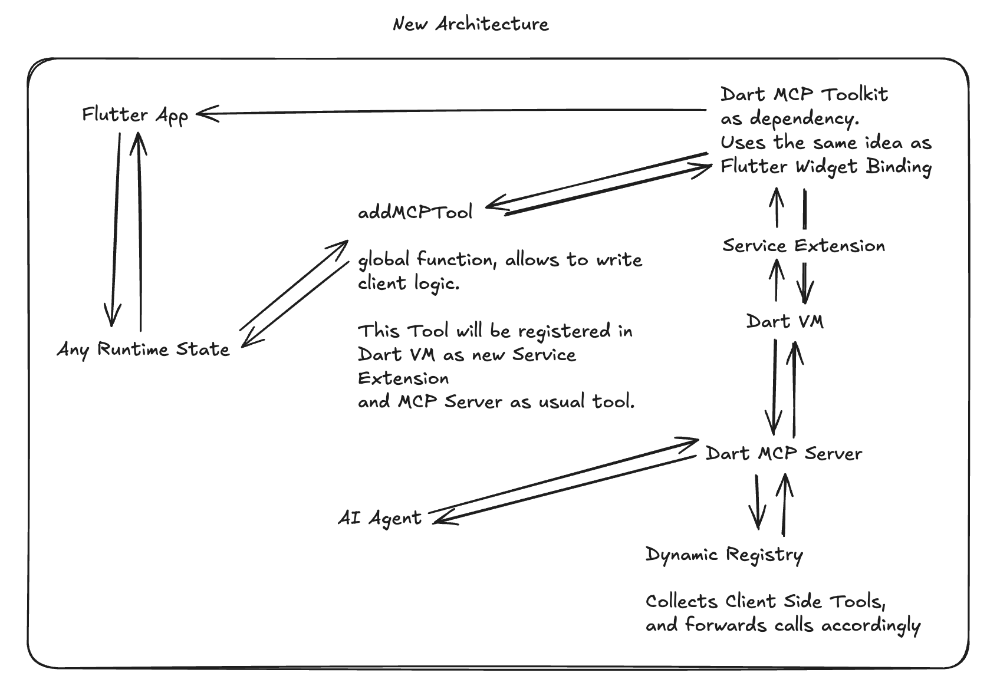

# Flutter Inspector Architecture

This doc is written mostly for AI.

## Quick Start

- [Installation Guide](QUICK_START.md)
- [API Documentation](MCP_RPC_DESCRIPTION.md)
- [Contributing Guidelines](README.md#contributing)

## System Overview

This project enables AI-powered development tools to interact with Flutter applications through a **Dart-based MCP server** with **dynamic tools registration** capabilities:

### Architecture Flow

```
┌─────────────────────────────┐     ┌──────────────────┐     ┌─────────────────────────────┐
│                             │     │                  │     │                             │
│  Flutter App                │<--->│    Dart VM       │<--->│ MCP Server Dart            │
│  + mcp_toolkit              │     │    Service       │     │ + Dynamic Registry         │
│  + Dynamic Tool Registration│     │    (Port 8181)   │     │                             │
│                             │     │                  │     │                             │
└─────────────────────────────┘     └──────────────────┘     └─────────────────────────────┘
```



This unified architecture supports:

- **Basic VM operations**: Memory inspection, debugging, isolate management
- **Flutter-specific operations**: Widget inspection, layout analysis, error reporting, screenshots
- **Dynamic tool registration**: Runtime tool discovery and custom functionality

### When to Use This

1. **Direct VM Service Communication**:
   - Memory inspection
   - Basic debugging operations
   - Isolate management
   - General VM state queries

2. **Flutter-Specific Operations**:
   - Widget tree inspection
   - Layout debugging
   - State management analysis
   - Performance profiling
   - UI element interaction

3. **Dynamic Tools Registration** 🆕:
   - Custom debugging tools
   - App-specific functionality
   - Runtime tool discovery
   - Event-driven tool updates

## Architecture Components

### 1. Flutter Application Layer

**Location**: Your Flutter App
**Purpose**: Debug target application
**Requirements**:

- Must run in debug mode
- `mcp_toolkit` package integrated, providing service extensions
- Port 8181 available for VM Service

### 2. MCP Toolkit Layer (In-App Service Extensions)

**Location**: `mcp_toolkit/mcp_toolkit/` (as a Dart package integrated into the Flutter Application)
**Purpose**: Exposes Flutter-specific functionalities to external tools (like AI assistants via the MCP/Forwarding server) through custom Dart VM Service extensions.
**Key Features**:

- Registers custom Dart VM Service extensions (e.g., `ext.mcp.toolkit.app_errors`, `ext.mcp.toolkit.view_screenshots`).
- Captures and reports Flutter application errors.
- Provides screenshot capabilities of the application's UI.
- Enables retrieval of application view details.
- Facilitates interaction with the Flutter application at a higher level than raw VM service calls.
- **🆕 Dynamic Tool Registration**: Allows runtime registration of custom tools and resources.

### 3. MCP Server Layer (Dart-based)

**Location**: `mcp_server_dart/`
**Purpose**: Protocol translation, request handling, capability registration, and dynamic registry management
**Key Features**:

- JSON-RPC to VM Service Protocol translation
- Request routing and validation
- Error handling and logging
- Connection management
- **Capability kernel** (v3.0.0+): the server hosts an `McpHost` registry into which `Capability` instances register prefixed tools (e.g. `core_tap_widget`). The host wires each registration to dart_mcp's `ToolsSupport` via a `DartMcpDispatchBridge`. The legacy unprefixed registration mixin is gated off by default and reachable only with `--no-use-capability-kernel`. See `mcp_capability_kernel/` (contracts) and `mcp_capability_core/` (the `core` capability shipping all 27 + 4-dump tools).
- Dynamic Registry: Manages runtime-registered tools and resources (forwarded from the running Flutter app via `addMcpTool`). The dispatch trio `listClientToolsAndResources` / `runClientTool` / `runClientResource` is host machinery and stays unprefixed.
- Event-Driven Discovery: Real-time tool detection via DTD events

### 4. AI Assistant Integration Layer

**Location**: AI Tool (e.g., Cline, Claude, Cursor)
**Purpose**: Developer interaction and analysis
**Features**:

- Code analysis and suggestions
- Widget tree visualization
- Debug information display
- Performance recommendations
- Dynamic Tool Discovery: Access to runtime-registered tools

## Communication Flow

### Standard Flow

1. **Request Initiation**:

   ```
   AI Assistant -> MCP JSON-RPC Request -> MCP Server Dart
   ```

2. **Protocol Translation & Interaction**:

   ```
   MCP Server Dart -> Dart VM Service (invoking mcp_toolkit extensions on Flutter App)
   ```

3. **Response Flow**:
   ```
   mcp_toolkit in Flutter App -> Dart VM Service -> MCP Server Dart -> AI Assistant
   ```

### Dynamic Registration Flow 🆕

1. **Tool Registration**:

   ```
   Flutter App -> MCPToolkitBinding.addEntries() -> DTD Event -> MCP Server Dart
   ```

2. **Discovery**:

   ```
   AI Assistant -> listClientToolsAndResources -> MCP Server Dart -> Dynamic Registry
   ```

3. **Execution**:
   ```
   AI Assistant -> runClientTool -> MCP Server Dart -> Dynamic Registry -> Flutter App
   ```

## Live Edit Overlay Architecture

> **Removed in v3.0.0.** The live-edit overlay package and its
> `live_edit_tooling_ui_kit` playground were excised from the v3.0.0
> release scope (see `todo/v3_release_audit_2026-04-28.md`). Design notes
> for re-integration live in `todo/selection_state_machine.md` and
> `todo/tool_surface_inversion.md` (live-edit references). This section
> is preserved as a placeholder for the planned v3.1.0 reintroduction.

## Protocol Details

### 1. MCP (Model Context Protocol)

- JSON-RPC 2.0 based
- Standardized message format
- Type-safe interactions
- Extensible command system
- Dynamic tool support

### 2. VM Service Protocol

- Flutter's native debugging protocol
- Real-time state access
- Widget tree manipulation
- Performance metrics collection

### 3. Dynamic Registry Protocol 🆕

- Event-driven tool discovery
- Runtime registration/unregistration
- Type-safe tool definitions
- Hot reload support

## Security Considerations

1. **Debug Mode Only**:
   - All operations require debug mode
   - No production access
   - Controlled environment execution

2. **Transport and Port Security**:
   - MCP server communication is stdio-based (no inbound MCP network port)
   - Default VM target port is `8181` (configurable with `--dart-vm-port`)
   - Local-only connections are recommended

3. **Data Safety**:
   - No sensitive data exposure
   - Sanitized error messages
   - Controlled access scope

4. **Dynamic Registration Security** 🆕:
   - Debug mode enforcement
   - Local-only tool registration
   - Sandboxed execution environment

## Performance Optimization

1. **Connection Management**:
   - Connection pooling
   - Automatic reconnection
   - Resource cleanup

2. **Data Efficiency**:
   - Response caching
   - Batch operations
   - Optimized protocol translation

3. **Error Handling**:
   - Graceful degradation
   - Detailed error reporting
   - Recovery mechanisms

4. **Dynamic Registry Performance**:
   - Event-driven updates (no polling)
   - Efficient tool lookup
   - Minimal overhead registration

## Extension Points

### 1. Custom Commands

```dart
// Add new commands via dynamic registration
final customTool = MCPCallEntry.tool(
  handler: (request) {
    // Your custom logic
    return MCPCallResult(message: 'Success', parameters: const {});
  },
  definition: MCPToolDefinition(
    name: 'custom_command',
    description: 'Your custom functionality',
    inputSchema: {...},
  ),
);

await MCPToolkitBinding.instance.addEntries(entries: {customTool});
```

## Common Use Cases

**Dynamic Tool Registration**:

```dart
// Example: Register custom debugging tool
final debugTool = MCPCallEntry.tool(
  handler: (request) => MCPCallResult(
    message: 'Debug info',
    parameters: {'state': getCurrentState()},
  ),
  definition: MCPToolDefinition(
    name: 'get_debug_state',
    description: 'Get current debug state',
    inputSchema: {'type': 'object', 'properties': {}},
  ),
);

await MCPToolkitBinding.instance.addEntries(entries: {debugTool});
```

## Dynamic Registry Architecture:

### Components

1. **DynamicRegistry**: Core registry managing tool/resource lifecycle
2. **RegistryDiscoveryService**: DTD event-driven discovery service
3. **DynamicRegistryTools**: MCP tools for registry interaction
4. **MCPToolkitBinding**: Client-side registration interface

### Event Flow

```
Flutter App Tool Registration -> DTD Event -> Discovery Service -> Registry Update -> MCP Tool Availability
```

### Tool Lifecycle

1. **Registration**: Flutter app calls `addEntries()`
2. **Discovery**: DTD event triggers server-side discovery
3. **Availability**: Tool becomes available via MCP protocol
4. **Execution**: AI assistant can call tool via `runClientTool`
5. **Cleanup**: Hot reload or app restart clears registry

## Troubleshooting

1. **Connection Issues**:
   - Verify debug mode is active
   - Check port availability
   - Confirm extension installation

2. **Protocol Errors**:
   - Validate message format
   - Check method availability
   - Verify parameter types

3. **Performance Problems**:
   - Monitor message volume
   - Check response times
   - Analyze resource usage

4. **Dynamic Registration Issues**:
   - Ensure `mcp_toolkit` is properly initialized
   - Check DTD event streaming
   - Verify tool schema compliance
   - Use `listClientToolsAndResources` for debugging

## Further Reading

- [Flutter DevTools Documentation](https://docs.flutter.dev/development/tools/devtools/overview)
- [VM Service Protocol](https://github.com/dart-lang/sdk/blob/main/runtime/vm/service/service.md)
- [MCP Protocol Specification](https://modelcontextprotocol.io/introduction)
- [Dart Toolkit Developer (DTD) Documentation](https://github.com/dart-lang/sdk/tree/main/pkg/dtd)
