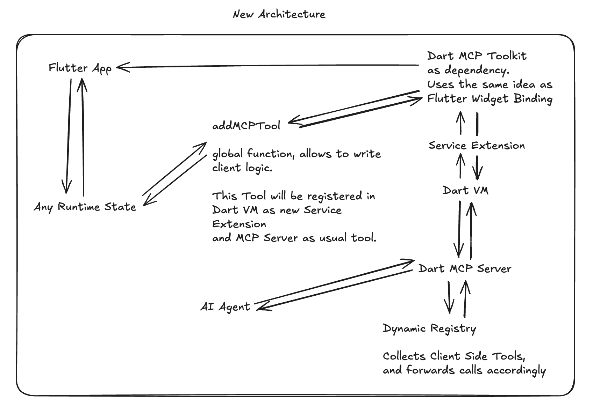

# 🚀 MCP Flutter - Quick Start Guide

This guide walks you through setting up the MCP Flutter toolkit to enable AI assistants to interact with Flutter applications.

## Overview

MCP Flutter provides a bridge between AI assistants and Flutter applications through the Model Context Protocol (MCP). The system uses **Flutter's native service extension mechanism** to enable real-time communication and **dynamic tools registration** for registering client side (Flutter App) tools and resources.

**Architecture:**
- **Mobile/Desktop**: `AI Assistant ↔ MCP Server ↔ Dart VM Service (port 8181) ↔ Flutter Service Extensions`
- **Web**: `AI Assistant ↔ MCP Server ↔ WebSocket Bridge (port 8183) ↔ Flutter Web App`

**⚠️ Critical Setup Requirement:**
- Your Flutter app's `main.dart` **must** check the platform using `kIsWeb` and use the appropriate initialization method
- **Web**: Use `initializeWebBridgeForWeb(bridgeUrl: 'ws://localhost:8183')`
- **Mobile/Desktop**: Use `initialize()` for VM Service
- See step 4 for the complete code template



## 📦 Prerequisites

- Flutter SDK (3.0.0 or later)
- Dart SDK (included with Flutter)
- A Flutter app running in debug mode
- One of: Cursor, Claude, Cline AI, Windsurf, RooCode, or any other AI assistant that supports MCP server

## 📺 Video Tutorial

- using Cursor: https://www.youtube.com/watch?v=pyDHaI81uts
- using VSCode + Cline: (Soon)

## 📦 Installation from GitHub (Currently Recommended)

For developers who want to contribute to the project or run the latest version directly from source, follow these steps:

1. **Clone the repository:**

   ```bash
   git clone https://github.com/Arenukvern/mcp_flutter
   cd mcp_flutter
   ```

2. **Install and build dependencies:**

   **On Linux/macOS:**
   ```bash
   make install
   ```

   **On Windows (PowerShell):**
   ```powershell
   .\install.ps1
   ```

   This command installs all necessary dependencies listed in `pubspec.yaml` and then builds the MCP server.

3. **Add `mcp_toolkit` Package to Your Flutter App:**

   The `mcp_toolkit` package provides the necessary service extensions within your Flutter application. You need to add it to your app's `pubspec.yaml`.

   Run this command in your Flutter app's directory to add the `mcp_toolkit` package:

   ```bash
   flutter pub add mcp_toolkit
   ```

   or add it to your `pubspec.yaml` manually:

   ```yaml
   dependencies:
     flutter:
       sdk: flutter
     # ... other dependencies
     mcp_toolkit: ^0.2.0
   ```

   Then run `flutter pub get` in your Flutter app's directory.

   **⚠️ Important for Web Support:**
   
   The `mcp_toolkit` package includes web bridge support that requires proper initialization. Make sure to use `initializeWebBridgeForWeb()` for web platforms as shown in step 4.

4. **Initialize in Your App**:
   In your Flutter application's `main.dart` file (or equivalent entry point), initialize the bridge binding:

   **⚠️ CRITICAL: Platform-Specific Initialization Required**
   
   The initialization code **must** check the platform using `kIsWeb` and use the appropriate method. This is essential for proper functionality on both web and mobile/desktop platforms.

   ```dart
   import 'package:flutter/material.dart';
   import 'package:flutter/foundation.dart';
   import 'package:mcp_toolkit/mcp_toolkit.dart';
   import 'dart:async';

   Future<void> main() async {
     runZonedGuarded(
       () async {
         WidgetsFlutterBinding.ensureInitialized();
         
         // CRITICAL: Platform-specific initialization
         if (kIsWeb) {
           // For Flutter Web: use WebSocket bridge (port 8183)
           // The web bridge connects to the MCP server's WebSocket bridge
           await MCPToolkitBinding.instance.initializeWebBridgeForWeb(
             bridgeUrl: 'ws://localhost:8183',
           );
           MCPToolkitBinding.instance.initializeFlutterToolkit();
         } else {
           // For Mobile/Desktop: use VM Service (port 8181)
           // Requires running with --enable-vm-service flag
           MCPToolkitBinding.instance
              ..initialize()
              ..initializeFlutterToolkit();
         }
         
         runApp(const MyApp());
       },
       (error, stack) {
         MCPToolkitBinding.instance.handleZoneError(error, stack);
       },
     );
   }
   ```

   **Note:** The app automatically detects the platform and uses the appropriate connection method (VM Service for mobile/desktop, WebSocket bridge for web).

5. **Start your Flutter app in debug mode**

   **For Mobile/Desktop:**
   
   ! Current workaround for security reasons is to run with `--disable-service-auth-codes`. If you know how to fix this, please let me know!

   ```bash
   flutter run --debug --host-vmservice-port=8182 --dds-port=8181 --enable-vm-service --disable-service-auth-codes
   ```

   The app will expose the Dart VM Service on port 8181, which the MCP server can connect to.

   **For Flutter Web:**
   ```bash
   flutter run -d chrome --web-port=8080
   ```

   The app will automatically connect to the WebSocket bridge on port 8183. The MCP server starts the web bridge automatically when initialized.

   **⚠️ Web Platform Limitations:**
   
   Flutter Web doesn't expose the Dart VM Service, so some tools are not available:
   - ✅ **Available**: `get_app_errors`, `get_screenshots`, `get_view_details`, `get_active_ports`
   - ✅ **Partially Available**: `listClientToolsAndResources` (works via web bridge, but requires web client connection)
   - ❌ **Not Available**: `get_vm`, `get_extension_rpcs`, `hot_reload_flutter`, `hot_restart_flutter`
   
   **Note on Hot Reload:** While Flutter Web supports hot reload (since Flutter 3.32/3.35), it can only be triggered through DevTools or terminal commands, both of which require the VM Service. There's no programmatic API to trigger hot reload on web without the VM Service. To use hot reload on web, you need to run the app with VM Service enabled (mobile/desktop mode) or use DevTools manually.
   
   **Important:** The web bridge uses WebSocket communication (port 8183) and requires:
   - The MCP server to be running (web bridge starts automatically on port 8183)
   - The Flutter app to initialize `initializeWebBridgeForWeb(bridgeUrl: 'ws://localhost:8183')` in `main.dart`
   - Both to be on the same machine (localhost)
   - Wait 30-40 seconds after starting the app for the connection to establish
   - The `kIsWeb` platform check is **required** - do not hardcode the platform
   
   **Setup Checklist:** See [docs/WEB_SETUP_CHECKLIST.md](../docs/WEB_SETUP_CHECKLIST.md) for a complete web platform setup checklist.
   
   These VM Service-specific tools require the Dart VM Service which is only available on mobile/desktop platforms.

6. **🛠️ Add Flutter Inspector to your AI tool**

   **Note for Local Development (GitHub Install):**

   If you installed the Flutter Inspector from GitHub and built it locally, you need to adjust the paths in the AI tool configurations to point to your local `build/flutter_inspector_mcp.exe` file (or `build/flutter_inspector_mcp` on Linux/macOS). Refer to the "Installation from GitHub" section for instructions on cloning and building the project.

   #### Cline Setup

   > Note: please use `--no-resources` flag to disable resources support - for unknown reason it doesn't work with Cline.

   1. Add to your `.cline/config.json`:
      ```json
      {
        "mcpServers": {
          "flutter-inspector": {
            "command": "/path/to/your/cloned/mcp_flutter/mcp_server_dart/build/flutter_inspector_mcp.exe",
            "args": [
              "--dart-vm-host=localhost",
              "--dart-vm-port=8181",
              "--no-resources",
              "--images"
            ],
            "env": {},
            "disabled": false,
            "autoApprove": []
          }
        }
      }
      ```
   2. Restart Cline
   3. The Flutter inspector will be automatically available in your conversations
   4. You're ready! Try commands like "Please get screenshot of my app" or "List all available tools from my Flutter app"

   #### Cursor Setup

   # ⚠️ Resources Limitations ⚠️

   - Since Cursor doesn't support resources, you need to pass `--no-resources` as an argument. It will make all resources to be displayed as tools instead.

   ##### Badge

   You can use this badge to add Flutter Inspector to Cursor:

   [](https://cursor.com/install-mcp?name=flutter-inspector&config=eyJjb21tYW5kIjoiL3BhdGgvdG8veW91ci9jbG9uZWQvbWNwX2ZsdXR0ZXIvbWNwX3NlcnZlcl9kYXJ0L2J1aWxkL2ZsdXR0ZXJfaW5zcGVjdG9yX21jcCAtLWRhcnQtdm0taG9zdD1sb2NhbGhvc3QgLS1kYXJ0LXZtLXBvcnQ9ODE4MSAtLW5vLXJlc291cmNlcyAtLWltYWdlcyIsImVudiI6e30sImRpc2FibGVkIjpmYWxzZX0%3D)
   <!-- to update use: https://docs.cursor.com/deeplinks#markdown -->

   Note: fix path after installation.

   ##### Manual Setup

   1. Open Cursor's settings
   2. Go to the Features tab
   3. Under "Model Context Protocol", add the server:
      ```json
      {
        "mcpServers": {
          "flutter-inspector": {
            "command": "/path/to/your/cloned/mcp_flutter/mcp_server_dart/build/flutter_inspector_mcp.exe",
            "args": [
              "--dart-vm-host=localhost",
              "--dart-vm-port=8181",
              "--no-resources",
              "--images"
            ],
            "env": {},
            "disabled": false
          }
        }
      }
      ```

   **⚠️ Important for Windows users:**
   - The executable is located at `mcp_server_dart/build/flutter_inspector_mcp.exe` (note the `build/` directory and `.exe` extension)
   - Use the full absolute path in Windows format: `C:\Users\YourName\Documents\projects\mcp_flutter\mcp_server_dart\build\flutter_inspector_mcp.exe`
   - Or use Git Bash format: `/c/Users/YourName/Documents/projects/mcp_flutter/mcp_server_dart/build/flutter_inspector_mcp.exe`
   - **Important:** On Windows, the executable must have the `.exe` extension in the path!
   4. Restart Cursor
   5. Open Agent Panel (cmd + L on macOS)
   6. You're ready! Try commands like "List all available tools from my Flutter app" or "Take a screenshot of my app"

   #### Claude Setup

   1. Add to your Claude configuration file:
      ```json
      {
        "mcpServers": {
          "flutter-inspector": {
            "command": "/path/to/your/cloned/mcp_flutter/mcp_server_dart/build/flutter_inspector_mcp.exe",
            "args": [
              "--dart-vm-host=localhost",
              "--dart-vm-port=8181",
              "--resources",
              "--images"
            ],
            "env": {},
            "disabled": false
          }
        }
      }
      ```
   2. Restart Claude
   3. The Flutter inspector tools will be automatically available
   4. You're ready! Try commands like "Show me all tools available in my Flutter app"

   #### RooCode Setup

   > Note: It seems that RooCode doesn't support images in MCP server responses as it was earlier with Cline and Cursor. So as a workaround you can use `--save-images` flag to save images to files.

   > Note: Also, please use `--no-resources` flag to disable resources support - for unknown reason it doesn't work with RooCode.

   1. Add to your RooCode configuration file:

   ```json
   {
     "mcpServers": {
       "flutter-inspector": {
         "command": "/path/to/your/cloned/mcp_flutter/mcp_server_dart/build/flutter_inspector_mcp",
         "args": [
           "--dart-vm-host=localhost",
           "--dart-vm-port=8181",
           "--no-resources",
           "--images",
           "--save-images"
         ],
         "env": {},
         "disabled": false
       }
     }
   }
   ```

## 🔧 Troubleshooting

### Web Platform Issues

**Problem: "VM service not connected and no web clients available"**

**Solution:**
1. Verify the MCP server is running and the web bridge started (check logs for "Web bridge server started on port 8183")
2. Ensure your Flutter app's `main.dart` uses `initializeWebBridgeForWeb()` for web platform:
   ```dart
   if (kIsWeb) {
     await MCPToolkitBinding.instance.initializeWebBridgeForWeb(
       bridgeUrl: 'ws://localhost:8183',
     );
   }
   ```
3. Check that the app is running: `flutter run -d chrome --web-port=8080`
4. Verify connection: Check if port 8183 is listening: `netstat -ano | findstr 8183` (Windows) or `lsof -i :8183` (macOS/Linux)
5. Wait 30-40 seconds after starting the app for the connection to establish

**Problem: "Bad state: VM service not connected" during initialization**

**Solution:**
This is normal when running on web. The MCP server now handles this gracefully and will use the web bridge instead. If you see this error repeatedly, ensure:
- The web bridge is properly initialized in your Flutter app
- The MCP server has been restarted after compilation
- You're using the latest version with web bridge support

### Connection Issues

- Ensure your Flutter app is running in debug mode
- Verify the port matches in both Flutter app and MCP server
- Check if the port is not being used by another process
- For web: Ensure both MCP server and Flutter app are on localhost

### Dynamic Tools Not Appearing

- Ensure `mcp_toolkit` package is properly initialized in your Flutter app
- Check that tools are registered using `MCPToolkitBinding.instance.addEntries()`
- Use `listClientToolsAndResources` to verify registration
- Hot reload your Flutter app after adding new tools
- For web: Wait for the web bridge connection to establish before tools appear

## Dynamic Tools Registration

One of the key features of v2.2.0 is the ability to register custom tools and resources from your Flutter app at runtime:

### Basic Example

```dart
import 'package:mcp_toolkit/mcp_toolkit.dart';
import 'package:dart_mcp/client.dart';

// Register a custom tool in your Flutter App (!).
final customTool = MCPCallEntry.tool(
  handler: (request) {
    final name = request['name'] ?? 'World';
    return MCPCallResult(
      message: 'Hello, $name!',
      parameters: {'greeting': 'Hello, $name!'},
    );
  },
  definition: MCPToolDefinition(
    name: 'say_hello',
    description: 'Say hello to someone',
    inputSchema: ObjectSchema(
      required: ['name'],
      properties: {
        'name': StringSchema(
          description: 'Name to greet',
        ),
      },
    ),
  ),
);

// Register the tool
await MCPToolkitBinding.instance.addEntries(entries: {customTool});
```

### Using Dynamic Tools

The tools should be registered automatically in MCP server. However, since most clients doesn't support tools/change feature, you have two options:

1. Reload MCP server (from interface).
2. Use `listClientToolsAndResources` to see all available tools and resources and then call `runClientTool` or `runClientResource` to execute them.

## 📦 Installation via Smithery (🚧 WIP 🚧)

To install Flutter Inspector for Claude Desktop automatically via [Smithery](https://smithery.ai/server/@Arenukvern/mcp_flutter):

```bash
npx -y @smithery/cli install @Arenukvern/mcp_flutter --client claude
```
