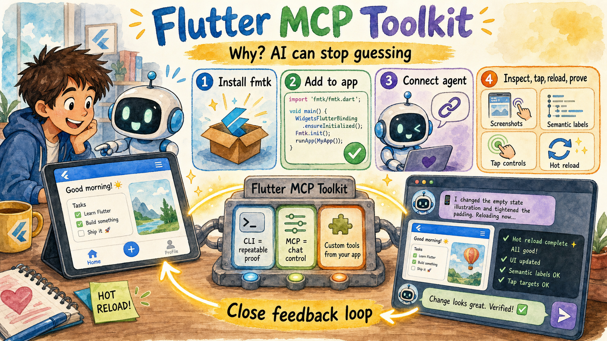

<div align="center">

# flutter-mcp-toolkit

_Inspect and drive a running Flutter app from your AI assistant._

[](https://skills.sh/arenukvern/mcp_flutter)
[](https://pub.dev/packages/mcp_toolkit)
[](https://github.com/Arenukvern/mcp_flutter/actions/workflows/contract_gates.yml)
[](https://github.com/Arenukvern/mcp_flutter/actions/workflows/intentcall_eval.yml)
[](https://github.com/Arenukvern/mcp_flutter/actions/workflows/skill_assets_drift.yml)
[](https://docs.page/arenukvern/mcp_flutter/)
[](https://opensource.org/licenses/MIT)
[](https://flutter.dev)
[](https://smithery.ai/server/@Arenukvern/mcp_flutter)
[](https://github.com/Arenukvern/mcp_flutter#contributors-)
<a title="Discord" href="https://discord.com/invite/y54DpJwmAn" ></a>
[](https://github.com/Arenukvern/skill_steward)

</div>

- 📖 **Docs:** [docs.page/arenukvern/mcp_flutter](https://docs.page/arenukvern/mcp_flutter/)
- 🤝 **Contribute:** [guide](docs/contributing/contribution_guide.mdx) · [contributors](docs/contributing/contributors.mdx) · [code of conduct](CODE_OF_CONDUCT.md) · [security](SECURITY.md)

`flutter-mcp-toolkit` is a Dart MCP server + Flutter package that lets AI Agents (Codex, Zed, Cursor, Intent, Claude Code, Cline, etc..) take (semantic snapshots, tap widgets, type into forms, hot-reload, and read logs from a Flutter app) or create __its own tools and resources at runtime__ using MCP Toolkit — without leaving the conversation and work with Flutter apps in closed feedback loop - see example of it described in [OpenAI Agentic Harness](https://openai.com/index/harness-engineering/).



The picture's story: the toolkit gives an AI assistant a shared window and control loop into a running Flutter app, so it can inspect state, act like a user, hot reload, read proof, and use custom tools from your app instead of guessing.


> ![NOTICE]: Version 4 is currently a prerelease train. Use `4.0.0-dev.5` only if you are intentionally testing the new architecture; otherwise stay on the latest stable 3.x release until `4.0.0` is promoted.

## Get started in 4 steps

```bash
# 1. Install the binary
curl -fsSL https://raw.githubusercontent.com/Arenukvern/mcp_flutter/main/install.sh | bash
# Installs flutter-mcp-toolkit plus the short fmtk alias for repeated CLI loops.

# 2. Add the toolkit to your Flutter app
cd my-flutter-app
flutter-mcp-toolkit codegen-init   # adds mcp_toolkit + emits main.dart snippet

# 3. Install skills for your AI agent
flutter-mcp-toolkit init claude-code   # or: cursor | codex | cline | agents-skills | all
# Alternative (skills only): npx skills add Arenukvern/mcp_flutter -a cursor -y

# 4. Run
flutter run --debug
```

That's it. Your AI agent can now inspect and drive the running app — and your app can expose **custom MCP tools at runtime** (see [Dynamic Tools Registration](#dynamic-tools-registration) below).


## 📰 News

- **2026-05-26** — v3.1.0: Platform-view capture routing, macOS/iOS Simulator host screenshots, web CDP tab capture (SCK → CDP → flutter_layer), and cross-platform showcase platform views.
<!-- TODO(arenukvern): add tool to write news automatically -->

## Install from marketplaces

| Platform | Command / link |
|----------|----------------|
| **Any agent (recommended)** | `flutter-mcp-toolkit init <agent>` — see [AI agent setup](docs/ai_agents/overview.mdx) |
| **Claude Code (git catalog)** | `/plugin marketplace add Arenukvern/mcp_flutter` then install `flutter-mcp-toolkit` |
| **Codex (git catalog)** | `codex plugin marketplace add Arenukvern/mcp_flutter` |
| **Cursor (local plugin)** | `flutter-mcp-toolkit init cursor` |
| **Skills only** | `npx skills add Arenukvern/mcp_flutter -a <agent> -y` (add MCP via `init` or manual JSON) |
| **MCP registries** | [Smithery](https://smithery.ai/server/@Arenukvern/mcp_flutter), [MseeP](https://mseep.ai/app/03aa0f2d-4ef7-40ae-93de-c7b87e0ac32d) |

Maintainers submitting to official stores: [marketplace submission runbook](docs/contributing/marketplace_submission_runbook.mdx). Full matrix: [marketplace distribution](docs/ai_agents/marketplace_distribution.mdx).

## Documentation

- **[Docs for AI Agent and Human](https://docs.page/arenukvern/mcp_flutter)** - wiki + llms.txt
- **[Migrating v2 → v3](docs/start_here/migration_v2_to_v3.mdx)** — `fmt_*` MCP tools, binaries, client config keys, `validate-runtime`.
- **[MCPCallEntry to AgentCallEntry migration](docs/start_here/migration_mcp_call_entry_to_agent_call_entry.md)** — `MCPCallEntry` removal, `AgentCallEntry`, platform `codegen sync`, `fmt_migrate_agent_entries`.
- **[IntentCall consumer guide](docs/intentcall/README.md)** — hosted `intentcall_*` dependency policy, consumer proof gates, and the boundary between `mcp_flutter` and upstream IntentCall architecture.
- **[Why this repo matters](docs/start_here/why_this_repo_matters.mdx)** — what it is, why it exists.
- **[CLI vs MCP](docs/start_here/cli_vs_mcp.mdx)** — pick the right mode.
- **[Feature map](docs/start_here/feature_map.mdx)** — the 30 tools.
- **[AI agent setup](docs/ai_agents/overview.mdx)** - for AI Agents.
- **[Marketplace distribution](docs/ai_agents/marketplace_distribution.mdx)** — Claude, Cursor, Codex, skills.sh.
- **[Architecture](ARCHITECTURE.md)** — for contributors.
- **[Quick Start](QUICK_START.md)**, **[Configuration](CONFIGURATION.md)**, **[MCP RPC description](MCP_RPC_DESCRIPTION.md)**

## Published packages

| Package | Pub.dev | Role |
|---|---|---|
| `mcp_toolkit` | [](https://pub.dev/packages/mcp_toolkit) [](https://pub.dev/packages/mcp_toolkit/score) | Flutter app package for runtime MCP tools/resources and toolkit bootstrap. |
| `flutter_mcp_toolkit_core` | [](https://pub.dev/packages/flutter_mcp_toolkit_core) [](https://pub.dev/packages/flutter_mcp_toolkit_core/score) | Pure-Dart shared command/result/capability types. |
| `flutter_mcp_toolkit_capability_kernel` | [](https://pub.dev/packages/flutter_mcp_toolkit_capability_kernel) [](https://pub.dev/packages/flutter_mcp_toolkit_capability_kernel/score) | Capability kernel contracts for composable MCP units. |
| `flutter_mcp_toolkit_capability_core` | [](https://pub.dev/packages/flutter_mcp_toolkit_capability_core) [](https://pub.dev/packages/flutter_mcp_toolkit_capability_core/score) | Server-side `fmt_*` capability implementation. |

The server binary lives in `mcp_server_dart` and is shipped through GitHub
Release artifacts as `flutter-mcp-toolkit`, `fmtk`, and
`flutter-mcp-toolkit-server`; it is not a pub.dev package.

## Development support

| Need | Start here |
|---|---|
| Contribute code or docs | [CONTRIBUTING.md](CONTRIBUTING.md) · [Contribution guide](docs/contributing/contribution_guide.mdx) |
| Add or credit contributors | [Contributors guide](docs/contributing/contributors.mdx) · [`.all-contributorsrc`](.all-contributorsrc) |
| Report vulnerabilities | [SECURITY.md](SECURITY.md) |
| Validate local changes | `steward probe --json --profile quick` · `make check-contracts` |
| Maintain releases | [Release train notes](CONTRIBUTING.md#maintainers) · [`flutter-mcp-toolkit-repo-maintainer`](plugin/skills/flutter-mcp-toolkit-repo-maintainer/SKILL.md) |
| Install or update agent skills | [AI agent setup](docs/ai_agents/overview.mdx) · [Marketplace distribution](docs/ai_agents/marketplace_distribution.mdx) |

## What it does

The default toolkit surface exposes 30 MCP tools under the `fmt_*` capability prefix across four categories:

- **Inspection** — semantic snapshot, view details, errors, screenshots, VM info
- **Interaction** — tap, scroll, type, fill forms, hot-reload, navigate, wait_for
- **Debug** — recent logs, evaluate Dart expressions
- **Lifecycle** — discover apps, hot-reload, hot-restart

See the `flutter-mcp-toolkit-{guide,inspect,control,debug}` skills for the full
reference (installed by `flutter-mcp-toolkit init` or `npx skills add Arenukvern/mcp_flutter`).
Install options: [AI agent setup](docs/ai_agents/overview.mdx).

### Dynamic Tools Registration

Flutter apps can register custom tools and resources at runtime. See how it
works in this [short YouTube video](https://www.youtube.com/watch?v=Qog3x2VcO98).
The same `arguments.connection` targeting is supported by the CLI's `exec`,
`batch`, daemon `command/execute`, daemon `watch/start`, and snapshot step args.


> [!NOTE]
> There is official [MCP Server for Flutter from Flutter team](https://github.com/dart-lang/ai/tree/main/pkgs/dart_mcp_server) which exposes Dart tooling.
> The **main goal of this project** is to bring power of MCP server tools by creating them in Flutter app, using **dynamic MCP tools registration** and close feedback loop for AI Agent. See how it works in [short YouTube video](https://www.youtube.com/watch?v=Qog3x2VcO98). See [Quick Start](https://docs.page/arenukvern/mcp_flutter) for more details. See [original motivation](https://github.com/Arenukvern/mcp_flutter/blob/main/CHANGELOG.md#210) behind the idea.

## ⚠️ Note on Dump RPCs

Dump RPC methods (like `dump_render_tree`) can produce huge token output and
are disabled by default. Enable with `--dumps`. See
[mcp_server_dart README](mcp_server_dart/README.md) for the full flag surface.

## 🔒 Security

Generally, since you use MCP server to connect to Flutter app in Debug Mode, it should be safe to use. However, I still recommend to review how it works in [ARCHITECTURE.md](ARCHITECTURE.md), how it can be modified to improve security if needed.

This MCP server is verified by [MseeP.ai](https://mseep.ai).

[](https://mseep.ai/app/arenukvern-mcp-flutter)

## 🔧 Troubleshooting

1. **Connection Issues**
   - Ensure your Flutter app is running in debug mode
   - Verify the port matches in both Flutter app and MCP server
   - Check if the port is not being used by another process
   - Safest explicit targeting: use `arguments.connection.uri` and paste exact Flutter machine `app.debugPort.wsUri`
   - If response includes `connection_selection_required`, retry with `arguments.connection.targetId` using one URI from `availableTargets` (or set `arguments.connection.uri` directly)

2. **AI Tool Not Detecting Inspector**
   - Restart the AI tool after configuration changes
   - Verify the configuration JSON syntax
   - Check the tool's logs for connection errors

3. **Dynamic Tools Not Appearing**
   - Ensure `mcp_toolkit` package is properly initialized in your Flutter app
   - Check that tools are registered using `MCPToolkitBinding.instance.addEntries()`
   - Use `fmt_list_client_tools_and_resources` to verify registration
   - Hot reload your Flutter app after adding new tools

The Flutter MCP Server is registered with Smithery's registry, making it discoverable and usable by other AI tools through a standardized interface.

### Integration Architecture

```
┌─────────────────┐     ┌───────────────────────┐     ┌─────────────────┐
│                 │     │  Flutter App with     │     │                 │
│  Flutter App    │<--->│  mcp_toolkit          │<--->│ flutter-mcp-    │
│  (Debug Mode)   │     │  (VM Svc. Extensions  │     │ toolkit-server  │
│                 │     │  + Dynamic Tools)     │     │                 │
└─────────────────┘     └───────────────────────┘     └─────────────────┘
```

## 🤝 Contributing

Contributions are welcome! See [CONTRIBUTING.md](CONTRIBUTING.md) (maintainer releases, binary checksums) and the [contribution guide](docs/contributing/contribution_guide.mdx). Pull requests and issues: [GitHub](https://github.com/Arenukvern/mcp_flutter).

## ✨ Contributors

Huge thanks to all contributors for making this project better!

This roster is maintained with [all-contributors](https://allcontributors.org/).
To add someone, update [`.all-contributorsrc`](.all-contributorsrc) and
regenerate the README table, or use the all-contributors bot/CLI from a PR.
More detail: [docs/contributing/contributors.mdx](docs/contributing/contributors.mdx).

<!-- https://allcontributors.org/docs/en/bot/usage -->

<!-- ALL-CONTRIBUTORS-LIST:START - Do not remove or modify this section -->
<!-- prettier-ignore-start -->
<!-- markdownlint-disable -->
<table>
  <tbody>
    <tr>
      <td align="center" valign="top" width="14.28%"><a href="https://calclavia.com"><br /><sub><b>Henry Mao</b></sub></a><br /><a href="#infra-calclavia" title="Infrastructure (Hosting, Build-Tools, etc)">🚇</a></td>
      <td align="center" valign="top" width="14.28%"><a href="https://github.com/marwenbk"><br /><sub><b>Marwen</b></sub></a><br /><a href="#doc-marwenbk" title="Documentation">📖</a></td>
      <td align="center" valign="top" width="14.28%"><a href="http://eastagile.com"><br /><sub><b>Lawrence Sinclair</b></sub></a><br /><a href="#doc-lwsinclair" title="Documentation">📖</a> <a href="#security-lwsinclair" title="Security">🛡️</a></td>
      <td align="center" valign="top" width="14.28%"><a href="https://glama.ai"><br /><sub><b>Frank Fiegel</b></sub></a><br /><a href="#infra-punkpeye" title="Infrastructure (Hosting, Build-Tools, etc)">🚇</a></td>
      <td align="center" valign="top" width="14.28%"><a href="https://github.com/Harishwarrior"><br /><sub><b>Harish Anbalagan</b></sub></a><br /><a href="#userTesting-Harishwarrior" title="User Testing">📓</a> <a href="#bug-Harishwarrior" title="Bug reports">🐛</a></td>
      <td align="center" valign="top" width="14.28%"><a href="https://github.com/torbenkeller"><br /><sub><b>Torben Keller</b></sub></a><br /><a href="#userTesting-torbenkeller" title="User Testing">📓</a> <a href="#bug-torbenkeller" title="Bug reports">🐛</a></td>
      <td align="center" valign="top" width="14.28%"><a href="https://github.com/rednikisfun"><br /><sub><b>Isfun</b></sub></a><br /><a href="#userTesting-rednikisfun" title="User Testing">📓</a> <a href="#bug-rednikisfun" title="Bug reports">🐛</a> <a href="#research-rednikisfun" title="Research">🔬</a> <a href="#code-rednikisfun" title="Code">💻</a></td>
    </tr>
    <tr>
      <td align="center" valign="top" width="14.28%"><a href="https://github.com/cosystudio"><br /><sub><b>Cosy Studio</b></sub></a><br /><a href="#userTesting-cosystudio" title="User Testing">📓</a> <a href="#bug-cosystudio" title="Bug reports">🐛</a> <a href="#research-cosystudio" title="Research">🔬</a></td>
      <td align="center" valign="top" width="14.28%"><a href="https://github.com/lukemmtt"><br /><sub><b>Luke Memet</b></sub></a><br /><a href="#userTesting-lukemmtt" title="User Testing">📓</a> <a href="#research-lukemmtt" title="Research">🔬</a> <a href="#maintenance-lukemmtt" title="Maintenance">🚧</a> <a href="#tutorial-lukemmtt" title="Tutorials">✅</a></td>
      <td align="center" valign="top" width="14.28%"><a href="https://commentatk-media.com"><br /><sub><b>Commentatk Media</b></sub></a><br /><a href="#code-CommentakMedia" title="Code">💻</a> <a href="#maintenance-CommentakMedia" title="Maintenance">🚧</a> <a href="#doc-CommentakMedia" title="Documentation">📖</a></td>
      <td align="center" valign="top" width="14.28%"><a href="https://www.linkedin.com/in/umitarslan/"><br /><sub><b>Umit Arslan</b></sub></a><br /><a href="#code-arslanmit" title="Code">💻</a> <a href="#maintenance-arslanmit" title="Maintenance">🚧</a></td>
      <td align="center" valign="top" width="14.28%"><a href="https://joelkitching.com/"><br /><sub><b>Joel Kitching</b></sub></a><br /><a href="#code-jkitching" title="Code">💻</a> <a href="#maintenance-jkitching" title="Maintenance">🚧</a></td>
      <td align="center" valign="top" width="14.28%"><a href="https://github.com/jeanlucthumm"><br /><sub><b>Jean-Luc Thumm</b></sub></a><br /><a href="#maintenance-jeanlucthumm" title="Maintenance">🚧</a></td>
      <td align="center" valign="top" width="14.28%"><a href="https://github.com/tekboxs"><br /><sub><b>Miguel Casagrande</b></sub></a><br /><a href="#code-tekboxs" title="Code">💻</a> <a href="#maintenance-tekboxs" title="Maintenance">🚧</a></td>
    </tr>
    <tr>
      <td align="center" valign="top" width="14.28%"><a href="https://github.com/drown0315"><br /><sub><b>drown0315</b></sub></a><br /><a href="#code-drown0315" title="Code">💻</a> <a href="#maintenance-drown0315" title="Maintenance">🚧</a> <a href="#bug-drown0315" title="Bug reports">🐛</a></td>
      <td align="center" valign="top" width="14.28%"><a href="https://github.com/druyang"><br /><sub><b>druyang</b></sub></a><br /><a href="#code-druyang" title="Code">💻</a> <a href="#maintenance-druyang" title="Maintenance">🚧</a> <a href="#bug-druyang" title="Bug reports">🐛</a></td>
    </tr>
  </tbody>
</table>

<!-- markdownlint-restore -->
<!-- prettier-ignore-end -->

<!-- ALL-CONTRIBUTORS-LIST:END -->

## 📖 Learn More

- [Flutter DevTools Documentation](https://docs.flutter.dev/development/tools/devtools/overview)
- [Dart VM Service Protocol](https://github.com/dart-lang/sdk/blob/main/runtime/vm/service/service.md)
- [Flutter DevTools RPC Constants (I guess and hope they are correct:))](https://github.com/flutter/devtools/tree/87f8016e2610c98c3e2eae8b1c823de068701dfd/packages/devtools_app/lib/src/shared/analytics/constants)

## Star History

[](https://www.star-history.com/#Arenukvern/mcp_flutter&Date)

## 📄 License

[MIT](LICENSE) - Feel free to use in your projects!

---

_Flutter and Dart are trademarks of Google LLC._
