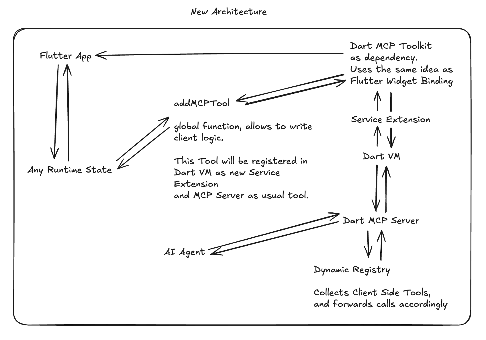

# Dynamic Tool Registration

Dynamic tool registration is the most powerful feature of the Flutter MCP Toolkit. It allows you to create custom tools within your Flutter application and make them available to the AI assistant at runtime.

### Architecture Flow

```
┌─────────────────────────────┐     ┌──────────────────┐     ┌─────────────────────────────┐
│                             │     │                  │     │                             │
│  Flutter App                │<--->│    Dart VM       │<--->│ MCP Server Dart            │
│  + mcp_toolkit              │     │    Service       │     │ + Dynamic Registry         │
│  + Dynamic Tool Registration│     │            │     │                             │
│                             │     │                  │     │                             │
└─────────────────────────────┘     └──────────────────┘     └─────────────────────────────┘
```



### How It Works

1.  **Create an `MCPCallEntry`**: In your Flutter app, you create an instance of the `MCPCallEntry` class. This class defines the tool's name, description, input schema, and handler function.

2.  **Register the Tool**: You then register the tool with the `MCPToolkitBinding` by calling the `addMcpTool()` or `addEntries()` method.

3.  **Discovery**: The MCP server automatically discovers the new tool through the Dart VM service and makes it available to the AI assistant.

### Example

Here is an example of how to create and register a simple tool that returns a greeting:

```dart
import 'package:mcp_toolkit/mcp_toolkit.dart';

void registerGreetingTool() {
  final greetingTool = MCPCallEntry.tool(
    handler: (params) {
      final name = params['name'] as String? ?? 'World';
      return MCPCallResult(message: 'Hello, $name!');
    },
    definition: MCPToolDefinition(
      name: 'greeting',
      description: 'Returns a greeting.',
      inputSchema: {
        'type': 'object',
        'properties': {
          'name': {
            'type': 'string',
            'description': 'The name to include in the greeting.',
          },
        },
      },
    ),
  );

  addMcpTool(greetingTool);
}
```
