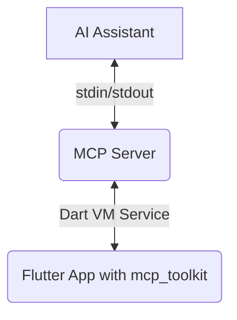

# Architecture

## Overview

This project is a monorepo containing the following packages:

- **`mcp_server_dart`**: The core MCP server.
- **`mcp_toolkit`**: The Flutter package that you include in your app.
- **`flutter_test_app`**: An example Flutter application.

## Architecture

1.  **The MCP Server (`mcp_server_dart`)**: A Dart-based server that acts as the central hub of communication. It connects to the AI assistant over `stdin`/`stdout` and to the Flutter application via the Dart VM service.

2.  **The MCP Toolkit (`mcp_toolkit`)**: A Flutter package that you include in your application. It provides the necessary tools for registering custom tools and communicating with the MCP server.

3.  **The Dart VM Service**: A powerful interface that allows tools to inspect and interact with a running Dart application. The MCP server uses the VM service to execute tools and receive events from the Flutter app.

### Communication Flow

1.  The AI assistant sends a request to the MCP server.
2.  The MCP server forwards the request to the Flutter app through the Dart VM service.
3.  The Flutter app executes the requested tool and sends the result back to the server.
4.  The server forwards the result to the AI assistant.
