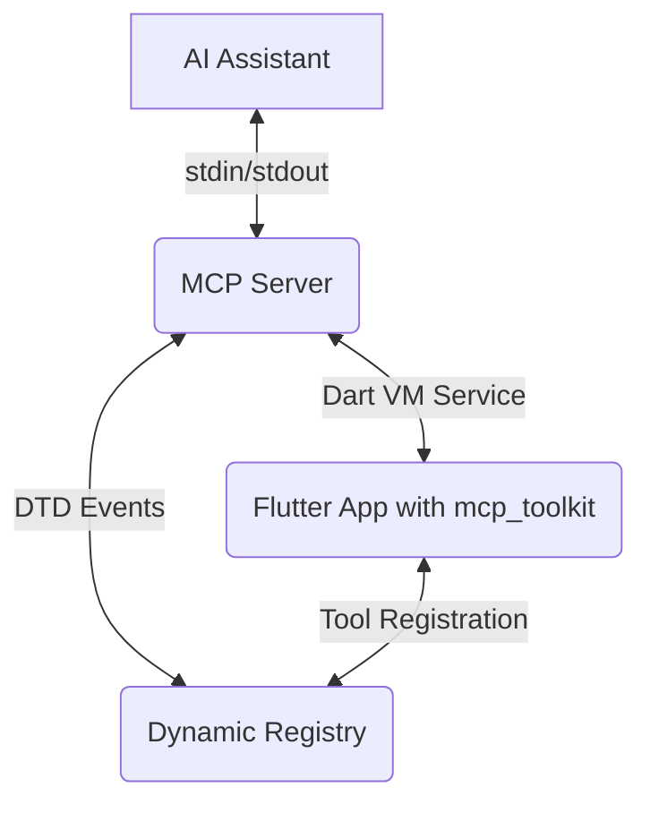

# Architecture

This document is written mostly for AI Agents.

## Quick Start

- [Installation Guide](../../llm_install.md)
- [Configuration Guide](./mcp_configuration.mdx)
- [Dynamic Tools Registry](./dynamic_tools_registry.mdx)
- [Contributing Guidelines](../../README.md#contributing)

## Overview

This project is a monorepo containing the following packages:

- **`mcp_server_dart`**: The core MCP server with dynamic registry capabilities.
- **`mcp_toolkit`**: The Flutter package that you include in your app.
- **`flutter_test_app`**: An example Flutter application demonstrating the toolkit.

## System Overview

This project enables AI-powered development tools to interact with Flutter applications through a **Dart-based MCP server** with **dynamic tools registration** capabilities:

### Architecture Flow

```
┌─────────────────────────────┐     ┌──────────────────┐     ┌─────────────────────────────┐
│                             │     │                  │     │                             │
│  Flutter App                │<--->│    Dart VM       │<--->│ MCP Server Dart            │
│  + mcp_toolkit              │     │    Service       │     │ + Dynamic Registry         │
│  + Dynamic Tool Registration│     │    (Port 8181)   │     │                             │
│                             │     │                  │     │                             │
└─────────────────────────────┘     └──────────────────┘     └─────────────────────────────┘
```

This unified architecture supports:

- **Basic VM operations**: Memory inspection, debugging, isolate management
- **Flutter-specific operations**: Widget inspection, layout analysis, error reporting, screenshots
- **Dynamic tool registration**: Runtime tool discovery and custom functionality

### When to Use This

1. **Direct VM Service Communication**:

   - Memory inspection
   - Basic debugging operations
   - Isolate management
   - General VM state queries

2. **Flutter-Specific Operations**:

   - Widget tree inspection
   - Layout debugging
   - State management analysis
   - Performance profiling
   - UI element interaction

3. **Dynamic Tools Registration** 🆕:
   - Custom debugging tools
   - App-specific functionality
   - Runtime tool discovery
   - Event-driven tool updates

## Architecture Components

### 1. Flutter Application Layer

**Location**: Your Flutter App
**Purpose**: Debug target application
**Requirements**:

- Must run in debug mode
- `mcp_toolkit` package integrated, providing service extensions
- Port 8181 available for VM Service

### 2. MCP Toolkit Layer (In-App Service Extensions)

**Location**: `mcp_toolkit/mcp_toolkit/` (as a Dart package integrated into the Flutter Application)
**Purpose**: Exposes Flutter-specific functionalities to external tools (like AI assistants via the MCP/Forwarding server) through custom Dart VM Service extensions.
**Key Features**:

- Registers custom Dart VM Service extensions (e.g., `ext.mcp.toolkit.app_errors`, `ext.mcp.toolkit.view_screenshots`).
- Captures and reports Flutter application errors.
- Provides screenshot capabilities of the application's UI.
- Enables retrieval of application view details.
- Facilitates interaction with the Flutter application at a higher level than raw VM service calls.
- **🆕 Dynamic Tool Registration**: Allows runtime registration of custom tools and resources.

### 3. MCP Server Layer (Dart-based)

**Location**: `mcp_server_dart/`
**Purpose**: Protocol translation, request handling, and dynamic registry management
**Key Features**:

- JSON-RPC to VM Service Protocol translation
- Request routing and validation
- Error handling and logging
- Connection management
- Dynamic Registry: Manages runtime-registered tools and resources
- Event-Driven Discovery: Real-time tool detection via DTD events

### 4. AI Assistant Integration Layer

**Location**: AI Tool (e.g., Cline, Claude, Cursor)
**Purpose**: Developer interaction and analysis
**Features**:

- Code analysis and suggestions
- Widget tree visualization
- Debug information display
- Performance recommendations
- Dynamic Tool Discovery: Access to runtime-registered tools

## Communication Flow

### Standard Flow

1. **Request Initiation**:

   ```
   AI Assistant -> MCP JSON-RPC Request -> MCP Server Dart
   ```

2. **Protocol Translation & Interaction**:

   ```
   MCP Server Dart -> Dart VM Service (invoking mcp_toolkit extensions on Flutter App)
   ```

3. **Response Flow**:
   ```
   mcp_toolkit in Flutter App -> Dart VM Service -> MCP Server Dart -> AI Assistant
   ```

### Communication Details



1. The AI assistant sends a request to the MCP server.
2. The MCP server forwards the request to the Flutter app through the Dart VM service.
3. The Flutter app executes the requested tool and sends the result back to the server.
4. The server forwards the result to the AI assistant.
5. Dynamic tools are discovered via DTD events and registered in real-time.

## Protocol Details

### 1. MCP (Model Context Protocol)

- JSON-RPC 2.0 based
- Standardized message format
- Type-safe interactions
- Extensible command system
- Dynamic tool support

### 2. VM Service Protocol

- Flutter's native debugging protocol
- Real-time state access
- Widget tree manipulation
- Performance metrics collection

### 3. Dynamic Registry Protocol 🆕

- Event-driven tool discovery
- Runtime registration/unregistration
- Type-safe tool definitions
- Hot reload support

## Security Considerations

1. **Debug Mode Only**:

   - All operations require debug mode
   - No production access
   - Controlled environment execution

2. **Port Security**:

   - Default ports: 8181 (VM), 8182 (MCP)
   - Local-only connections
   - Port validation and verification

3. **Data Safety**:

   - No sensitive data exposure
   - Sanitized error messages
   - Controlled access scope

4. **Dynamic Registration Security** 🆕:
   - Debug mode enforcement
   - Local-only tool registration
   - Sandboxed execution environment

## Performance Optimization

1. **Connection Management**:

   - Connection pooling
   - Automatic reconnection
   - Resource cleanup

2. **Data Efficiency**:

   - Response caching
   - Batch operations
   - Optimized protocol translation

3. **Error Handling**:

   - Graceful degradation
   - Detailed error reporting
   - Recovery mechanisms

4. **Dynamic Registry Performance**:
   - Event-driven updates (no polling)
   - Efficient tool lookup
   - Minimal overhead registration

## Extension Points

### 1. Custom Commands

```dart
// Add new commands via dynamic registration
final customTool = MCPCallEntry.tool(
  handler: (request) {
    // Your custom logic
    return MCPCallResult(message: 'Success');
  },
  definition: MCPToolDefinition(
    name: 'custom_command',
    description: 'Your custom functionality',
    inputSchema: {...},
  ),
);

await MCPToolkitBinding.instance.addEntries(entries: {customTool});
```

## Common Use Cases

1. **Widget Analysis**:

   ```dart
   // Example: Get widget tree
   final widgetTree = await inspector.getRootWidget();
   ```

2. **Layout Debugging**:

   ```dart
   // Example: Analyze layout issues
   final layoutInfo = await inspector.debugDumpRenderTree();
   ```

3. **Performance Profiling**:
   ```dart
   // Example: Profile widget builds
   await inspector.profileWidgetBuilds({ enabled: true });
   ```

## Troubleshooting

1. **Connection Issues**:

   - Verify debug mode is active
   - Check port availability
   - Confirm extension installation

2. **Protocol Errors**:

   - Validate message format
   - Check method availability
   - Verify parameter types

3. **Performance Problems**:
   - Monitor message volume
   - Check response times
   - Analyze resource usage

## Further Reading

- [Flutter DevTools Documentation](https://docs.flutter.dev/development/tools/devtools/overview)
- [VM Service Protocol](https://github.com/dart-lang/sdk/blob/main/runtime/vm/service/service.md)
- [MCP Protocol Specification](https://modelcontextprotocol.io/introduction)
- [Dart Toolkit Developer (DTD) Documentation](https://github.com/dart-lang/sdk/tree/main/pkg/dtd)
