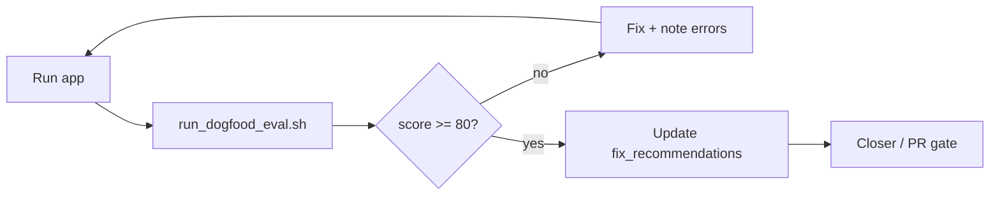

# MCP / intentcall tool quality evals

Iterative dogfood framework for scoring **flutter-mcp-toolkit** and **intentcall** integration on `flutter_test_app`. Each run produces comparable dimension scores, tracks `recurring_errors` / `fix_recommendations`, and appends to the showcase tracker when requested.

## Philosophy

1. **Evidence before scores** — Runtime checks (`validate-runtime`) and static gates (`codegen sync --check`, `init intentcall-platform --check`, `migrate agent-entries --check`) must run fresh; stale YAML is not a gate.
2. **Comparable iterations** — Same rubric (`tool_quality_rubric.yaml`), same battery script, same app (`flutter_test_app`). Iteration *N* should be diffable against *N−1*.
3. **Dimensions, not vibes** — Eight weighted dimensions (connectivity, schema validity, handler correctness, capture quality, visual fidelity, WebMCP parity, intentcall authoring, docs truth). Pass at **≥80/100**; warn below **90** when shipping.
4. **Recurring patterns** — Warnings that appear in ≥2 iterations promote to `recurring_warnings`; errors to `recurring_errors`. Agents propose `fix_recommendations`; humans accept or defer.
5. **Legacy compatibility** — Early dogfood iterations (1–4) used flat weights (`validate_runtime_ok`, `extensions_ok`, …). The rubric maps those fields into dimensions so historical runs stay readable.

## Rubric

| Dimension | Weight | Pass min (of weight) |
|-----------|--------|----------------------|
| connectivity | 20 | 16 |
| schema_validity | 10 | 8 |
| handler_correctness | 20 | 16 |
| capture_quality | 10 | 8 |
| visual_fidelity | 10 | 8 |
| webmcp_parity | 10 | 8 |
| intentcall_authoring | 10 | 8 |
| docs_truth | 10 | 8 |

Machine-readable source: [`tool_quality_rubric.yaml`](./tool_quality_rubric.yaml).

Tracker file (web dogfood history): [`docs/evidence/dogfood/dogfood_web_eval.yaml`](../../evidence/dogfood/dogfood_web_eval.yaml) ([ADR 0011](/decisions/0011_dogfood_tracker_evidence_split)).

WebMCP-specific verification (separate from VM dogfood): [2026-05-26-webmcp-verification.md](./2026-05-26-webmcp-verification.md).

Archived spec gap matrix (iter 1–11): [archive/2026-05-26-dogfood-spec-gap-matrix.md](./archive/2026-05-26-dogfood-spec-gap-matrix.md). Current iterations: [`docs/evidence/dogfood/dogfood_web_eval.yaml`](../../evidence/dogfood/dogfood_web_eval.yaml).

## Workspace layout (Phase 7)

intentcall libraries live under **`intentcall/packages/`** (standalone workspace). Dogfood and CLI commands run from **mcp_flutter** repo root; `run_dogfood_eval.sh` runs `dart test packages/intentcall_testing` inside `intentcall/`.

## How to run

### 1. Start the app (runtime battery)

**Web with WebMCP flags (recommended — repeatable across machines):**

```bash
make web-showcase
# Visual reconstruct dogfood (boots /visual-reconstruct, no showcase tap):
DOGFOOD_VISUAL=1 make web-showcase
# or: dart run mcp_server_dart/bin/flutter_mcp_toolkit.dart webmcp chrome-args
```

Copy `WS_URI` from `.showcase/web_app.log` (printed when ready).

**Web (plain Chrome — WebMCP API usually inactive):**

```bash
cd flutter_test_app
flutter run -d chrome --web-port=8080 --host-vmservice-port=8181
```

After launch, probe WebMCP:

```bash
dart run mcp_server_dart/bin/flutter_mcp_toolkit.dart webmcp verify --web-port 8080
```

**macOS (optional `--macos` battery):**

```bash
make showcase-stop && make showcase
```

### 2. Run the standard battery

From repo root:

```bash
# Full web battery + merge into dogfood tracker (--merge uses yq or dart fallback)
export WS_URI='ws://127.0.0.1:8181/<token>/ws'
bash tool/evals/run_dogfood_eval.sh --merge

# Snapshot only (no tracker merge)
bash tool/evals/run_dogfood_eval.sh --ws-uri "$WS_URI"

# Include macOS validate-runtime (second WS_URI) + intentcall_testing
bash tool/evals/run_dogfood_eval.sh \
  --ws-uri "$WS_URI" \
  --macos --macos-ws-uri "$MACOS_WS" \
  --run-intentcall-tests \
  --merge

# Static gates only (no running app)
bash tool/evals/run_dogfood_eval.sh --skip-runtime

# Skip warm-path guild compare (validate-runtime only)
bash tool/evals/run_dogfood_eval.sh --ws-uri "$WS_URI" --skip-visual
```

**Visual fidelity (warm path):** When `WS_URI` is set and sibling `flutter_harness` exists, the battery runs **`warm_path_direct.hs.yaml`** (canonical — not scroll/tap `warm_path.hs.yaml`). The app should boot on `/visual-reconstruct` via **`DOGFOOD_VISUAL=1`** (see `scripts/run_web_showcase.sh` → `--dart-define=DOGFOOD_VISUAL=true`). Capture uses `screenshot_mode: flutter_layer` on Chrome. Golden: `flutter_test_app/test/goldens/visual_reconstruct.png`. Guild: `flutter_visual_reconstruct/profiles/dogfood_warm.yaml`. Verdict: copied to `.showcase/eval_runs/<id>/visual_verdict.yaml` (and harness `artifacts/verdict.yaml`). Override script: `VISUAL_HS=…/warm_path_direct.hs.yaml`. Requires `HARNESS_ROOT` if not at `../flutter_harness`.

**Viewport / DPR (Chrome :8080):** Warm scores are only comparable when the browser viewport and device pixel ratio match the golden. Default dogfood uses **`WEB_PORT=8080`** and a maximized or consistent Chrome window. Widget tests generate the golden at **1.0 DPR** in the test binding; live Chrome capture may differ if the window is scaled or DPR ≠ 1 — `dogfood_warm.yaml` relaxes thresholds accordingly. For reproducible scores: same machine, same Chrome zoom (100%), avoid fractional OS display scaling, and prefer `DOGFOOD_VISUAL=1` over tap navigation.

```bash
# Manual warm path (canonical)
DOGFOOD_VISUAL=1 make web-showcase
export WS_URI="$(grep -Eo 'ws://127\.0\.0\.1:[0-9]+/[A-Za-z0-9_=-]+/ws' .showcase/web_app.log | tail -1)"
cd ../flutter_harness
bundle=$(mktemp -d)
dart run bin/flutter_harness.dart --save-images run \
  harness/examples/visual_reconstruct/warm_path_direct.hs.yaml \
  --connection uri --vm-service-uri "$WS_URI" --bundle-dir "$bundle"
cat harness/examples/visual_reconstruct/artifacts/verdict.yaml
```

```bash
# Makefile shortcuts
make dogfood-eval-static   # PR gate (no app)
make dogfood-eval          # needs WS_URI
make web-showcase          # Chrome + WebMCP flags
```

### CI

| Trigger | Job | Command |
|---------|-----|---------|
| PR + push | `intentcall-static` | `make dogfood-eval-static` |
| Weekly + `main` | `intentcall-weekly` | intentcall package tests + static battery |

Workflow: [`.github/workflows/intentcall_eval.yml`](../../.github/workflows/intentcall_eval.yml). Full Chrome runtime dogfood stays local until a headless WebMCP runner is cost-effective.

Agent skills (run `make sync-skills` after edits):

| Skill | Use |
|-------|-----|
| `flutter-mcp-toolkit-maintain-web` | Chrome, WebMCP, web codegen |
| `flutter-mcp-toolkit-maintain-macos` | macOS showcase, native invoke |
| `flutter-mcp-toolkit-dogfood-iterations` | Rubric battery + tracker |

Artifacts:

- Per-run folder: `.showcase/eval_runs/<timestamp>/` (`validate-runtime.json`, check logs, `eval_run.yaml`)
- With `--merge`: updates `docs/evidence/dogfood/dogfood_web_eval.yaml` iteration list + `summary`
- Without `--merge`: `.showcase/eval_run_<timestamp>.yaml` at repo root

### 3. Interpret results

- **`score`** — Weighted sum across dimensions (0–100).
- **`verdict`** — `pass` | `pass_with_warnings` | `fail` | `blocked_no_runtime`.
- **`summary.recurring_*`** — Promote fixes across iterations; do not clear without a passing re-run.
- **`fix_recommendations`** — Actionable doc/product deltas (e.g. fmt_ vs bare exec names on web).

Extended release gate (not in default battery):

```bash
make check-contracts   # includes docs_truth signals
```

## Iteration workflow (agents)



1. Run battery; append iteration (or merge).
2. If score regresses, diff `dimension_scores` vs previous iteration.
3. Add warnings to `recurring_warnings` when repeated.
4. Ship only when `verdict: pass` or accepted `pass_with_warnings`.

## Sample output structure

See `.showcase/eval_run_<timestamp>.yaml` after a run. Minimal shape:

```yaml
run_id: "20260526T120000Z"
rubric: docs/superpowers/evals/tool_quality_rubric.yaml
device: chrome
score: 92
verdict: pass_with_warnings
dimension_scores:
  connectivity: 20
  schema_validity: 10
  handler_correctness: 20
  capture_quality: 10
  visual_fidelity: 10
  webmcp_parity: 10
  intentcall_authoring: 10
  docs_truth: 10
checks:
  codegen_sync: { exit: 0, ok: true }
  init_intentcall_platform: { exit: 0, ok: true }
  migrate_agent_entries: { exit: 0, ok: true }
  validate_runtime: { exit: 0, ok: true, artifact: .showcase/eval_runs/.../validate-runtime.json }
errors: []
warnings: [visual_capture_truth_mode]
recurring_errors: []
fix_recommendations: []
```

## Related docs

- [flutter-mcp-cli-runtime-validation](https://github.com/Arenukvern/mcp_flutter/blob/main/plugin/skills/flutter-mcp-cli-runtime-validation/SKILL.md)
- [migration_mcp_call_entry_to_agent_call_entry.md](../../start_here/migration_mcp_call_entry_to_agent_call_entry.md)
- [flutter_test_app/INTENTCALL_PLATFORM.md](../../flutter_test_app/INTENTCALL_PLATFORM.md)
