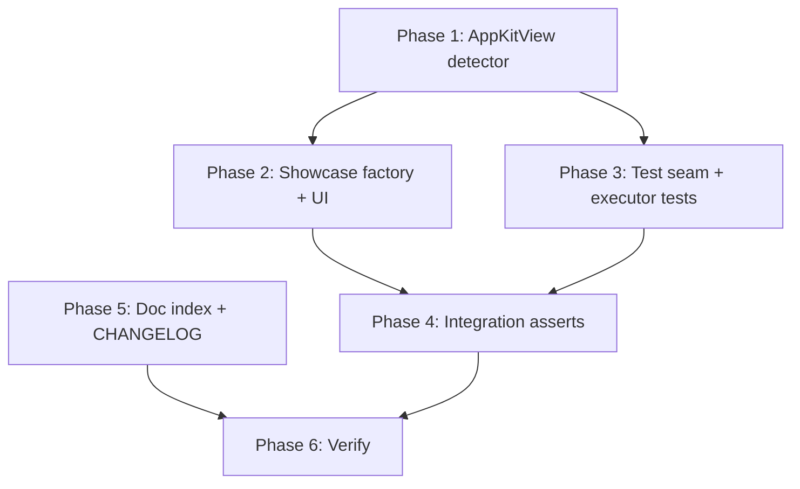

# Platform-view showcase + test gap closure

**Status:** Done  
**Parent:** [capture_gaps_and_web_adr](file:///Users/anton/.cursor/plans/capture_gaps_and_web_adr_0d1bdcb4.plan.md) reverification (May 2026)  
**Goal:** Make macOS showcase a **true-positive** for `captureHints.platformViewsDetected`, harden executor/integration tests, and fix doc/consistency nits.

---

## Key design decisions

| Decision               | Choice                                                                                                | Rationale                                                                                                                           |
| ---------------------- | ----------------------------------------------------------------------------------------------------- | ----------------------------------------------------------------------------------------------------------------------------------- |
| Showcase signal        | Real **`AppKitView`** on macOS (minimal `NSView` factory)                                             | Exercises real widget tree + `RenderAppKitView`; avoids fake trees that drift from production introspection.                        |
| Detector parity        | Add **`AppKitView` / `RenderAppKitView`** to strong suffix lists in `packages/core` (+ synced copies) | macOS showcase cannot satisfy today’s `UiKitView`-only strong signals; without this, showcase stays `platformViewsDetected: false`. |
| Executor unit tests    | **`ConnectionContext.debugViewDetailsPayload`** test seam                                             | Avoids full VM connect + extension mock for 3 missing cases; mirrors existing `debugConnectedVmPidOverride` pattern.                |
| Failure `captureHints` | **Assert existing behavior** (L580–581); fix only if test proves regression                           | Implementation already attaches `captureHints` when `hints.platformViewsDetected` on desktop failure.                               |
| validate-runtime guard | Call **`shouldSkipFlutterLayerFallback(hints)`**                                                      | Single source of truth vs inline `!capturePlatformViewsDetected` (behavior unchanged).                                              |
| Web / iOS showcase     | **macOS-only** in this pass                                                                           | `run_showcase.sh` targets macOS; iOS Simulator host capture already covered elsewhere; web deferred per ADR 0007.                   |

---

## Current gaps (baseline)

| Gap                                                                                           | Severity               |
| --------------------------------------------------------------------------------------------- | ---------------------- |
| Showcase has no platform view → integration asserts tolerate `false`                          | High                   |
| `AppKitView` not in detector strong list                                                      | High (blocks showcase) |
| Executor tests: `auto`+upgrade, `flutter_layer`+warnings, failure+`captureHints` in `details` | Medium                 |
| Duplicate ADR rows in `decisions/index.mdx` + `docs/decisions/index.mdx`                      | Low                    |
| validate-runtime duplicates skip logic                                                        | Low                    |

---

## Phase 1 — Detector parity (prerequisite)

**Files**

- [`packages/core/lib/src/visual_capture/platform_view_hints.dart`](packages/core/lib/src/visual_capture/platform_view_hints.dart)
- [`mcp_toolkit/lib/src/services/platform_view_hints.dart`](mcp_toolkit/lib/src/services/platform_view_hints.dart) (keep in sync)
- [`packages/core/test/platform_view_hints_test.dart`](packages/core/test/platform_view_hints_test.dart)

**Changes**

1. Add to `_strongWidgetSuffixes`: `AppKitView`
2. Add to `_strongRenderSuffixes`: `RenderAppKitView`
3. Unit test: tree with `AppKitView` + `RenderAppKitView` → `platformViewsDetected: true`, `recommendedMode: desktop_window`

**Verify:** `dart test packages/core/test/platform_view_hints_test.dart`

---

## Phase 2 — Showcase platform view (macOS)

### 2a. Native factory (minimal)

**New:** `flutter_test_app/macos/Runner/ShowcasePlatformViewFactory.swift`

- Register `FlutterPlatformViewFactory` with id `showcase.platform.stub`
- Factory returns a small `NSView` (e.g. 120×40 colored box + “Native” label) — enough to be visible in `desktop_window` capture

**Wire:** [`flutter_test_app/macos/Runner/MainFlutterWindow.swift`](flutter_test_app/macos/Runner/MainFlutterWindow.swift) (or `AppDelegate`) — `registrar.register(factory, withId: "showcase.platform.stub")`

Add Swift file to Xcode project (`project.pbxproj`) if not auto-included.

### 2b. Flutter UI

**New:** `flutter_test_app/lib/platform_view_showcase.dart`

- `ShowcasePlatformViewPanel` — fixed height ~48, `Semantics(identifier: 'platform_view_demo_panel')`
- Child: `AppKitView(viewType: 'showcase.platform.stub', ...)` when `defaultTargetPlatform == TargetPlatform.macOS`
- Other platforms: compact `Text` stub (“Platform view demo — macOS only”) so `flutter run` on other targets still builds

**Update:** [`flutter_test_app/lib/showcase_screen.dart`](flutter_test_app/lib/showcase_screen.dart)

- New section after **Inspect** (or before Footer):
  - Label: `Capture`
  - Heading: `Native view for screenshot routing`
  - Hint documents: `get_view_details` → `captureHints`; `get_screenshots mode:auto` → `desktop_window` on macOS host

### 2c. DX

**Update:** [`scripts/run_showcase.sh`](scripts/run_showcase.sh) comment block — note Capture section + Screen Recording permission for `desktop_window` validation.

**Optional:** `make showcase` help one-liner in [`mcp_server_dart/README.md`](mcp_server_dart/README.md) under visual capture.

---

## Phase 3 — Executor test seam + missing tests

### 3a. Test seam

**File:** [`mcp_server_dart/lib/src/shared_core/vm_connections/connection_context.dart`](mcp_server_dart/lib/src/shared_core/vm_connections/connection_context.dart)

```dart
/// Test-only: when set, view_details scan uses this payload without VM extension I/O.
@visibleForTesting
Map<String, Object?>? debugViewDetailsPayload;
```

**File:** [`command_executor.dart`](mcp_server_dart/lib/src/shared_core/command_executor.dart) — `_scanPlatformViewHints`:

- If `connectionContext.debugViewDetailsPayload != null` → `_hintsFromPayload(debugViewDetailsPayload!)` (skip `_ensureVmConnected` + extension for scan only)
- Document: does not affect `flutter_layer` capture path (still needs VM when that mode runs)

### 3b. Extend [`platform_view_capture_flow_test.dart`](mcp_server_dart/test/platform_view_capture_flow_test.dart)

| Test                                            | Setup                                                                                                                                                                                                                                   | Assert                                                                                                               |
| ----------------------------------------------- | --------------------------------------------------------------------------------------------------------------------------------------------------------------------------------------------------------------------------------------- | -------------------------------------------------------------------------------------------------------------------- |
| `auto` upgrades when UiKitView in debug payload | `debugViewDetailsPayload` with nested `UiKitView`; macOS config; fake desktop success                                                                                                                                                   | `ok`; `actualMode` / `captureMode` `desktop_window`; `captureHints`; upgrade warning                                 |
| `flutter_layer` + platform views                | Same payload; `mode: flutterLayer`; mock extension for `view_screenshots` **or** skip VM by only testing metadata path via `_withCaptureHints` unit — **prefer:** fake `callFlutterExtension` only for screenshots if seam insufficient | `warnings` contains platform-view text; **no** `desktopCaptureRetried`                                               |
| Desktop failure + platform views                | `debugViewDetailsPayload` with `UiKitView`; `_AlwaysFailFakeAdapter`; `mode: auto` (upgraded)                                                                                                                                           | `ok == false`; `error.details['captureHints']['platformViewsDetected'] == true`; no `images` key in failure envelope |

**Note:** `flutter_layer` success path needs VM + `view_screenshots` extension. Options:

1. Extend `debugViewDetailsPayload` + add `debugViewScreenshotsPayload` for screenshot bytes, **or**
2. Test `_withCaptureHints` via package-visible test hook (heavier)

**Recommendation:** add `debugViewScreenshotsPayload` returning minimal base64 PNG map when set — keeps tests hermetic.

### 3c. validate-runtime consistency

**File:** [`mcp_server_dart/bin/flutter_mcp_toolkit.dart`](mcp_server_dart/bin/flutter_mcp_toolkit.dart)

- Import `shouldSkipFlutterLayerFallback`
- Replace `!capturePlatformViewsDetected` guards (L696, L779) with `shouldSkipFlutterLayerFallback(PlatformViewHints(...))` **or** build hints once from probe and reuse

---

## Phase 4 — Integration test hardening

**File:** [`mcp_server_dart/test/flutter_mcp_example_app_integration_test.dart`](mcp_server_dart/test/flutter_mcp_example_app_integration_test.dart)

Behind `RUN_FLUTTER_MCP_INTEGRATION=1` **and** `Platform.isMacOS`:

1. After `fmt_get_view_details`: `expect(captureHints['platformViewsDetected'], isTrue)` (remove tolerant bool-only check)
2. `fmt_get_screenshots` `mode: auto`: `expect(actualMode, 'desktop_window')`
3. Optional: `mode: flutter_layer` → expect `warnings` non-empty (if extension returns warnings in payload)
4. Document in test header: requires `make showcase` / running `flutter_test_app` on macOS with native factory registered

**CI:** Default CI stays mock-only; integration group skipped without env flag (unchanged).

---

## Phase 5 — Doc hygiene + changelog

| Item                                                   | Action                                                                |
| ------------------------------------------------------ | --------------------------------------------------------------------- |
| [`decisions/index.mdx`](decisions/index.mdx) L24–25    | Remove duplicate 0006/0007 rows                                       |
| [`docs/decisions/index.mdx`](docs/decisions/index.mdx) | Same                                                                  |
| [`CHANGELOG.md`](CHANGELOG.md)                         | Unreleased: AppKitView detection, showcase platform view, test seam   |
| Skills / `skill_assets.g.dart`                         | Mention AppKitView + showcase Capture section; run `make sync-skills` |

---

## Phase 6 — Verification checklist

```bash
# Unit (always-on)
dart test packages/core/test/platform_view_hints_test.dart
dart test mcp_server_dart/test/desktop_capture_recovery_test.dart
dart test mcp_server_dart/test/platform_view_capture_flow_test.dart

# Manual macOS (showcase)
make showcase   # or scripts/run_showcase.sh
# In another terminal:
RUN_FLUTTER_MCP_INTEGRATION=1 dart test mcp_server_dart/test/flutter_mcp_example_app_integration_test.dart --name "capture"

# Spot-check tools
flutter-mcp-toolkit exec --name get_view_details --args '{"connection":{"targetId":"$WS"}}'
flutter-mcp-toolkit exec --name get_screenshots --args '{"connection":{"targetId":"$WS"},"mode":"auto","compress":true}'
```

**GitNexus (before merge):** `gitnexus_impact` on `detectPlatformViews`, `_scanPlatformViewHints`, `ConnectionContext.callFlutterExtension`; `gitnexus_detect_changes` before commit.

---

## Out of scope (this plan)

- Web headful capture (ADR 0007 Phase A/B)
- iOS `UiKitView` in showcase (optional follow-up)
- PNG black-pixel heuristic
- Hint-scan TTL cache

---

## Suggested implementation order



**Estimate:** ~1 focused session (detector + tests + docs) + ~0.5 session (Swift factory + manual integration).

---

## Acceptance criteria

- [x] `make showcase` on macOS → `get_view_details.captureHints.platformViewsDetected == true` (showcase `AppKitView` + integration asserts; see manual verification below)
- [x] `get_screenshots mode:auto` → `actualMode == desktop_window` with showcase running (integration + `platform_view_capture_flow_test.dart`)
- [x] Executor tests cover auto-upgrade, flutter_layer warnings, desktop failure + `captureHints` in `details`
- [x] ADR index has single row per ADR 0006/0007
- [x] validate-runtime uses `shouldSkipFlutterLayerFallback`
- [x] All always-on dart tests green in CI

### Manual verification (not CI-gated)

Live end-to-end capture routing still requires a running showcase and integration env:

```bash
make showcase-stop   # end stray test_app / flutter run / :8181 listeners
make showcase        # or scripts/run_showcase.sh — macOS, Screen Recording if using desktop_window
# In another terminal:
RUN_FLUTTER_MCP_INTEGRATION=1 dart test mcp_server_dart/test/flutter_mcp_example_app_integration_test.dart
```

Integration tests call `scripts/stop_showcase.sh` in `setUpAll` / `tearDownAll` automatically.

CI runs mock/unit tests only; integration group is skipped without `RUN_FLUTTER_MCP_INTEGRATION=1`.
